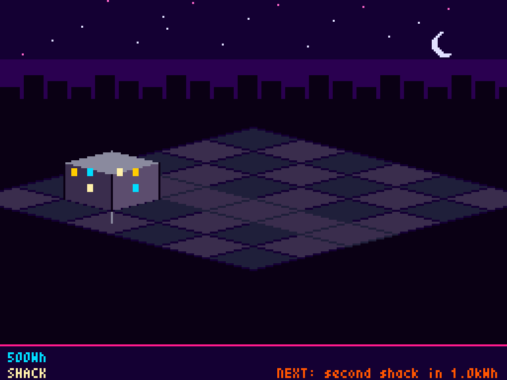
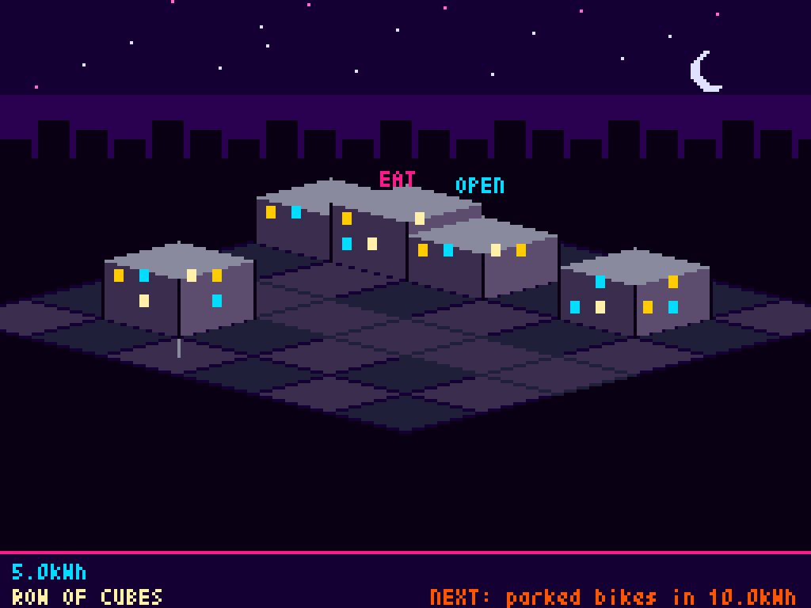
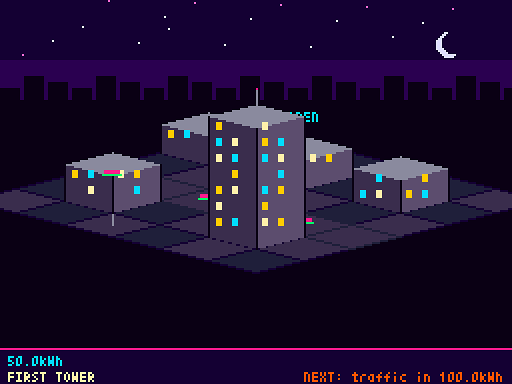
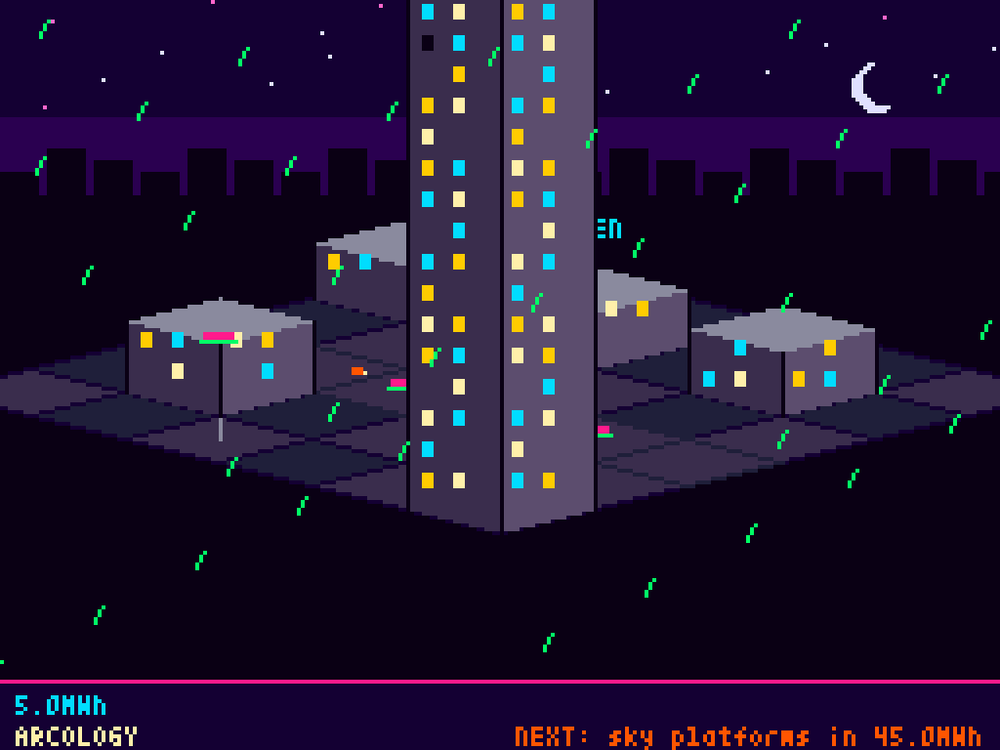

# claudewatts

> A live energy meter in your Claude Code status bar.

**🌐 [Project page →](https://jonnonz1.github.io/claudewatts/)**

claudewatts installs a one-line meter into Claude Code's [`statusLine`](https://docs.claude.com/en/docs/claude-code/statusline) hook. Every time Claude Code refreshes its status bar, claudewatts reads your local transcripts, multiplies tokens by published Wh-per-token estimates, and prints a live readout in units a human can actually feel:

```
⚡ 2× active · 3.4 Wh session · 10.9 kWh today · 342.7 kWh total (≈ powering 11 US homes for a day)
```

That line lives at the bottom of every Claude Code session after one-line install (see [Install](#install) below).

There's also an optional **cyberpunk city that grows with your cumulative Wh** — see [`cwatts town`](#optional-cwatts-town).

Claude Code already records token usage, and token usage is the raw material of an LLM's energy cost. This tool reads your local transcript files (`~/.claude/projects/**/*.jsonl`), multiplies tokens by published watt-hour-per-token estimates, and renders the result in familiar units: Google searches, kettle boils, phone charges, village-days. It runs entirely on your machine — no network calls, no API keys, no telemetry.

## Why this exists

Token counters tell you dollars. They don't tell you *joules*. And the conversation about "LLMs are expensive to run" tends to be hand-wavy on both sides — proponents claim negligible energy, critics claim boiling oceans. Neither side usually shows their working. This tool is small, open, and transparent so you can do your own arithmetic and argue from numbers.

It is **not** precise. Anthropic does not publish per-token energy figures. What this tool does is apply mid-range estimates from public sources (Google Gemini's 2025 disclosure, Epoch AI, Simon Couch's Claude Code study) to your real token counts. See [docs/METHODOLOGY.md](docs/METHODOLOGY.md) for the derivation, the sources, and a worked sanity check.

## What it measures

Five scopes, computed in a single pass over your transcripts:

| Scope      | What it covers                                                                 |
|------------|--------------------------------------------------------------------------------|
| `session`  | The specific transcript you're currently in                                    |
| `active`   | All transcripts with activity in the last 10 minutes (parallel sessions)       |
| `repo`     | All transcripts whose cwd is inside a given directory                          |
| `today`    | All messages across all transcripts on your local calendar day                 |
| `total`    | Cumulative across everything `~/.claude/projects/` has ever recorded           |

Scopes overlap on purpose — a recent message in the current session counts toward all five.

## Install

### Option 1 — Claude Code plugin (recommended)

Inside Claude Code:

```
/plugin marketplace add jonnonz1/claudewatts
/plugin install claudewatts@jonnonz1-claudewatts
```

Restart Claude Code. The statusLine appears automatically. The plugin also exposes `/cwatts` for the full report.

### Option 2 — Homebrew

```bash
brew install jonnonz1/tap/claudewatts
cwatts install claude     # wires the statusLine into ~/.claude/settings.json
```

### Option 3 — Clone

```bash
git clone https://github.com/jonnonz1/claudewatts ~/claudewatts
~/claudewatts/cwatts install claude
```

No dependencies beyond Python 3.9+ in any case. Single file. See [docs/INSTALL.md](docs/INSTALL.md) for manual setup, env-var tuning, and uninstall.

## Quick start

```bash
# Full report for the current repo
cwatts report --repo .

# One-liner (for statusLine hooks or your own UI)
cwatts statusline --repo .

# Machine-readable
cwatts json --repo .
```

## Tuning the estimate

All constants are environment variables. Override them to run conservative or dramatic:

```bash
# Conservative (closer to Epoch AI's low estimate for efficient inference)
export CPM_WH_INPUT=0.00015
export CPM_WH_OUTPUT=0.00075

# Dramatic (closer to older GPT-4-class figures, uncached)
export CPM_WH_INPUT=0.0006
export CPM_WH_OUTPUT=0.003
```

See [docs/METHODOLOGY.md](docs/METHODOLOGY.md) for what each constant represents and why the defaults are what they are.

## Commands

- **`cwatts`** or **`cwatts report`** — Full breakdown, every scope, every comparison unit.
- **`cwatts statusline`** — One line. Designed for Claude Code's status bar.
- **`cwatts json`** — Machine-readable. Pipe into `jq`, log to a TSDB, build a dashboard.
- **`cwatts install claude`** — Wire up as a Claude Code statusLine.

All non-install commands accept:

- `--session-transcript <path>` — scope the `session` total to this transcript file
- `--repo <dir>` — scope the `repo` total to this directory (use `.` for cwd)
- `--projects-dir <dir>` — override where transcripts are read from (default `~/.claude/projects/`)

## Optional: `cwatts town`

A tiny isometric cyberpunk city that grows with your cumulative Wh. Procedurally drawn neon-on-dark with [pyxel](https://github.com/kitao/pyxel). The city is a *pure function of cumulative Wh* — same energy, same scene; no save file, no levelling treadmill.

```bash
pip install 'claudewatts[town]'
cwatts town
```

| | | | |
|:-:|:-:|:-:|:-:|
|  |  |  |  |
| **500 Wh** — shack | **5 kWh** — row of cubes | **50 kWh** — first tower | **5 MWh** — arcology |

Tech tree (every threshold adds one visible thing):

| Wh         | Unlock          |
|------------|-----------------|
| 50         | first lamp post |
| 200        | dirt path       |
| 500        | shack           |
| 1.5 kWh    | second shack    |
| 5 kWh      | row of cube houses + neon signs |
| 15 kWh     | parked hover-bikes |
| 50 kWh     | first tower     |
| 150 kWh    | traffic on the road |
| 500 kWh    | megabuilding + roof hologram |
| 1.5 MWh    | acid rain       |
| 5 MWh      | arcology        |
| 50 MWh     | sky platforms   |

Preview any tier without waiting for real usage:

```bash
cwatts town --wh 50kwh        # see the "first tower" tier
cwatts town --wh 5mwh         # see the "arcology" tier
```

To regenerate the per-tier screenshots used on the project page:

```bash
./scripts/generate-screenshots.sh
```

## License

MIT. See [LICENSE](LICENSE).
